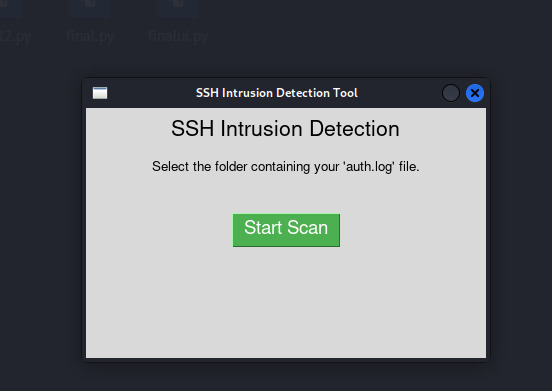
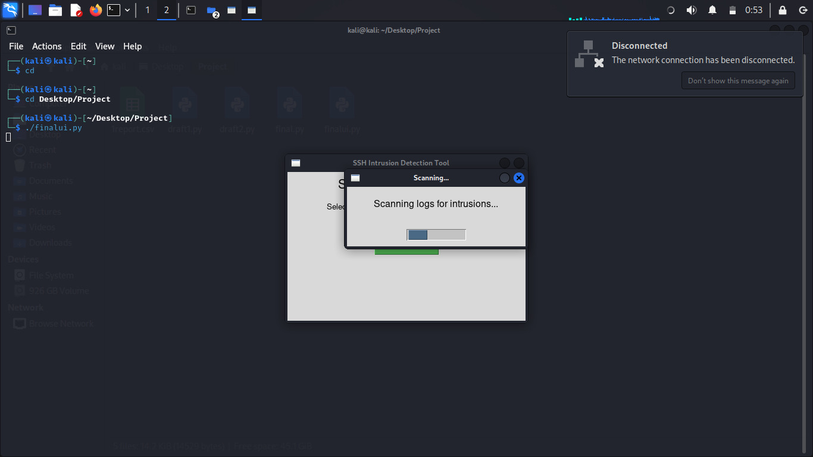
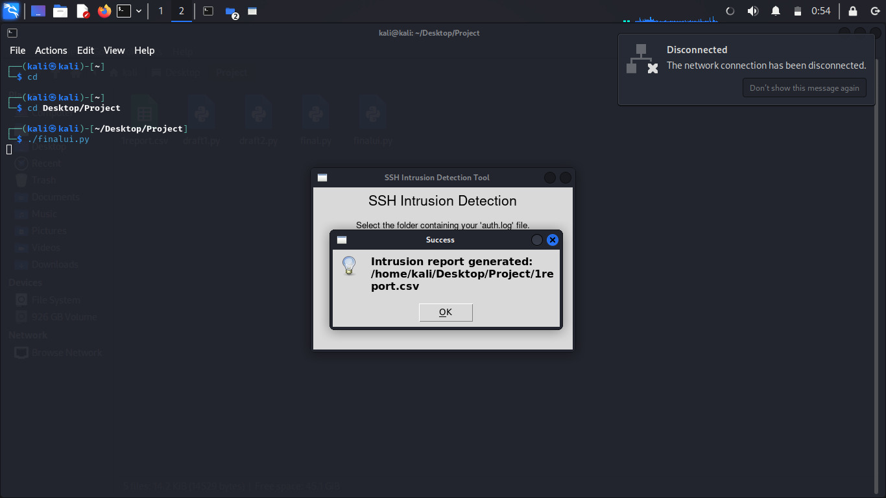

# Security Log Analysis and Threat Detection

## Overview

Security Log Analysis and Threat Detection is a Python-based security monitoring tool designed to analyze Linux authentication logs and identify suspicious activities that may indicate unauthorized access attempts or malicious behavior.

The tool automates the process of parsing authentication logs, extracting attack indicators, classifying security events, and generating structured reports to support threat detection and security investigations.

A graphical user interface (GUI) built using Tkinter provides a simple workflow for selecting log files, performing analysis, and exporting results.

---

## Features

- Automated Linux Authentication Log Analysis
- Detection of Failed Authentication Attempts
- Detection of Invalid User Enumeration Attempts
- Identification of Suspicious Login Activities
- IPv4 and IPv6 Address Extraction
- Event Classification and Categorization
- CSV Report Generation
- Graphical User Interface (GUI)
- Simulated Scanning Workflow

---

## Technologies Used

- Python
- Linux
- Tkinter
- Pandas
- Regular Expressions (Regex)
- Logwatch

---

## Security Events Detected

| Log Pattern | Event Classification |
|------------|---------------------|
| Failed Password | Authentication Failure |
| Invalid User | User Enumeration Attempt |
| Accepted Password | Successful Login Monitoring |
| Connection Closed | Suspicious Connection Activity |
| Disconnected From | SSH Session Disconnection |
| No Identification Received | Scanner / Bot Activity |

---

## Project Workflow

1. User selects a folder containing the authentication log file.
2. The application scans and parses log entries.
3. Security events are identified based on predefined attack patterns.
4. Relevant indicators such as timestamps, IP addresses, and event types are extracted.
5. Events are classified and organized into a structured format.
6. A CSV report is generated for further analysis and investigation.

---

## Sample Detection Output

| Timestamp | IP Address | Event Type |
|------------|------------|------------|
| Apr 30 00:15:32 | 192.168.1.15 | Authentication Failure |
| Apr 30 00:16:11 | 192.168.1.15 | Invalid Username Attempt |
| Apr 30 00:17:12 | ::1 | Successful Login |

---

## Screenshots

### Main Interface

### Log Scanning Process

### Report Generation

---

## Future Enhancements

- Real-Time Log Monitoring
- Email Alert Notifications
- GeoIP-Based IP Enrichment
- Threat Scoring System
- MITRE ATT&CK Technique Mapping
- Dashboard Visualization
- Automated Alerting Mechanisms

---

## Learning Outcomes

Through this project, the following concepts were explored:

- Linux Authentication Logging
- Security Event Monitoring
- Log Parsing and Pattern Matching
- Threat Detection Fundamentals
- Security Reporting Automation
- Python-Based Security Tool Development

---

## Author

Shreyas Madhukar

Cybersecurity | Linux Security | Threat Detection | Offensive Security
